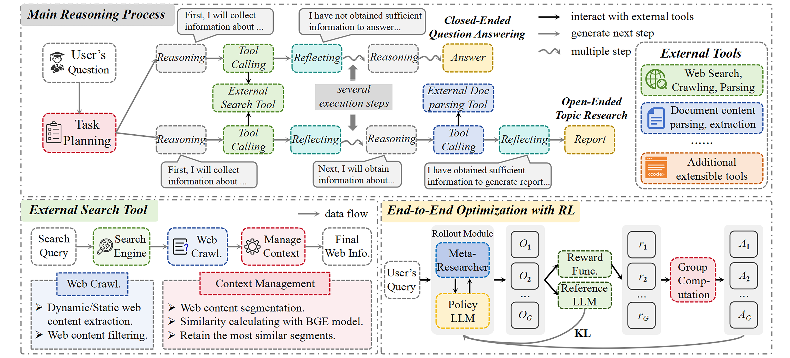

<h1 align="center"> Meta-Researcher: Empowering Planning and Reflection Mechanisms in Large Reasoning Models for Advanced Deep Research Capabilities </h1>

## Overview

**Meta-Researcher** is an open-source deep research framework designed to accelerate research and development at the intersection of reinforcement learning (RL) and agents. Inspired by the design methodology of the Agent-R1 framework, our framework employs end-to-end reinforcement learning combined with web search tool to train deep research agents. It is highly extensible: developers can easily adapt the framework to their unique application scenarios by simply defining domain-specific tools and reward functions, eliminating the need for complex workflow engineering. The code implementation is currently being organized and will be released soon for use by the developer community.

## Core Contributions

- **Explicit Task Planning**: Performing explicit task planning for research topics through tool calls, decoupling complex problems to improve the accuracy of information gathering
- **Multi-tool Coordination**: Training agents to effectively coordinate and utilize multiple tools in concert to solve complex tasks
- **Explicit Autonomous Reflection**: Explicitly outputting the autonomous reflection process via tool calls, enabling timely identification of information gaps and iterative completion, ensuring the model demonstrates metacognitive capabilities in practice
- **Multi-turn Tool Use and Reasoning**: Supporting multi-turn reasoning and multi-turn tool calls
- **End-to-End Reinforcement Learning**: Employing end-to-end reinforcement learning on complete interaction trajectories, further enhancing the model's autonomous decision-making and metacognitive abilities through carefully designed reward functions

## Feedback
We welcome all forms of feedback! Please raise an issue for bugs, questions, or suggestions. This helps our team address common problems efficiently and builds a more productive community.
